# Mermaid Diagram Test

## Flowchart

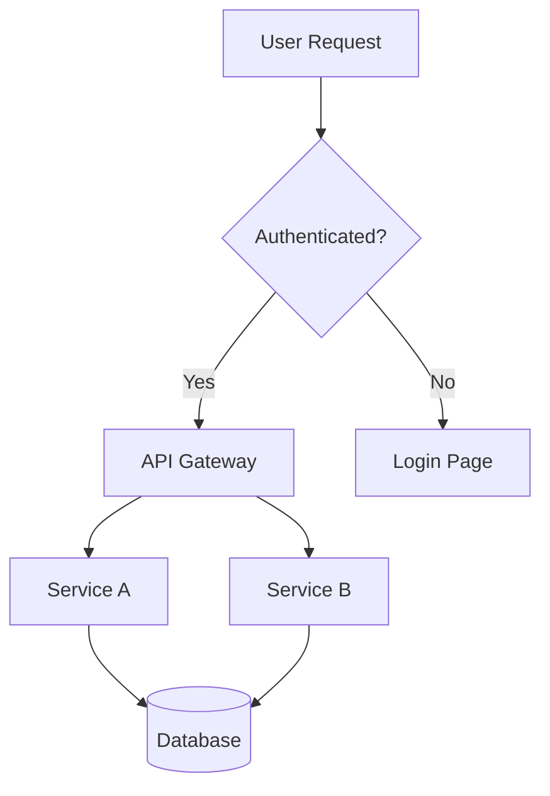

## Sequence Diagram

```mermaid
xychart-beta
    title Monthly Revenue (USD)
    x-axis [Jan, Feb, Mar, Apr, May, Jun]
    y-axis "Revenue" 0 --> 50000
    bar  [12000, 18000, 15000, 22000, 30000, 28000]
    line [12000, 18000, 15000, 22000, 30000, 28000]
```

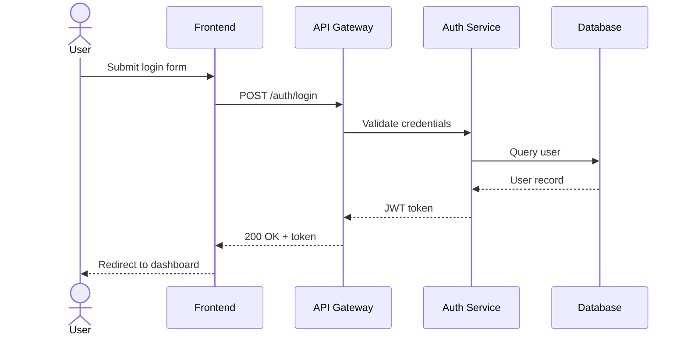

## Class Diagram

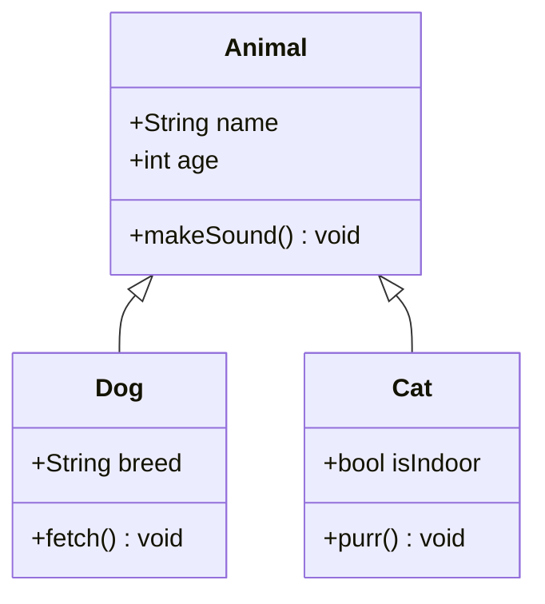

## ER Diagram

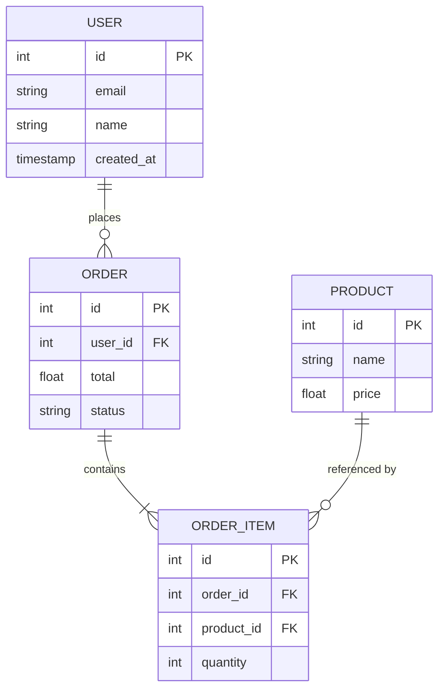

## State Diagram

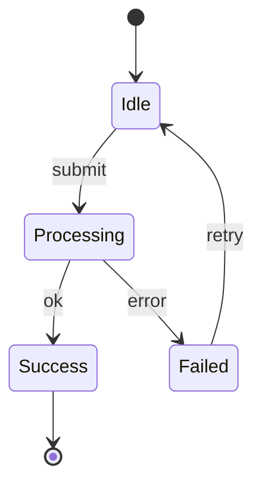

## C4 Context Diagram

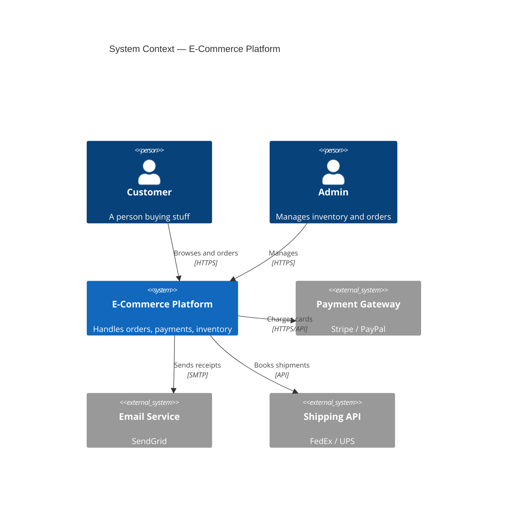

## C4 Container Diagram

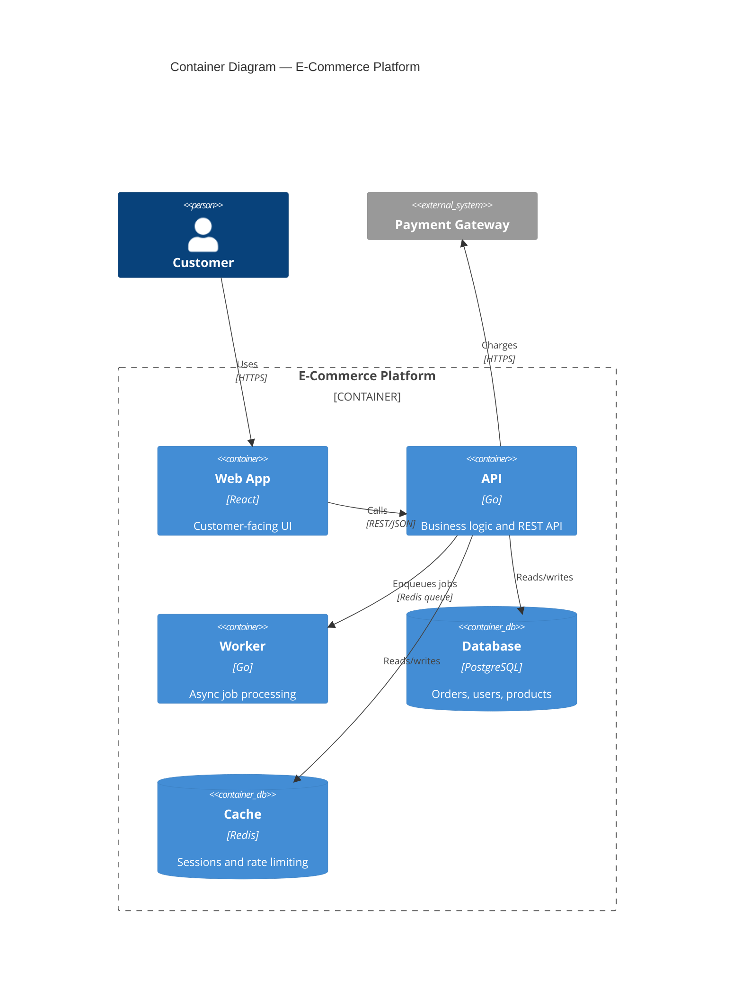

## Gantt Chart

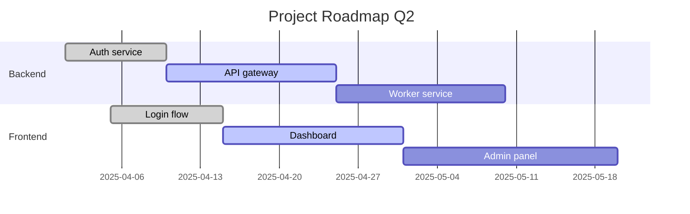

## Git Graph

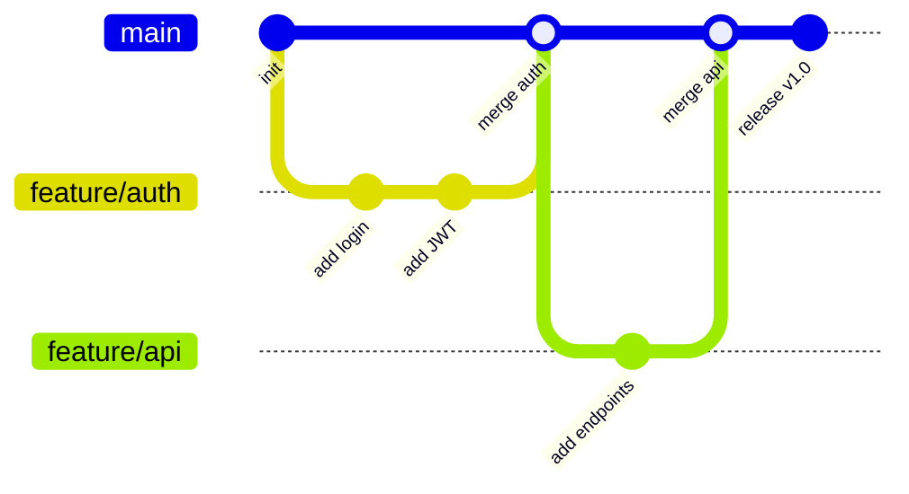

## Pie Chart

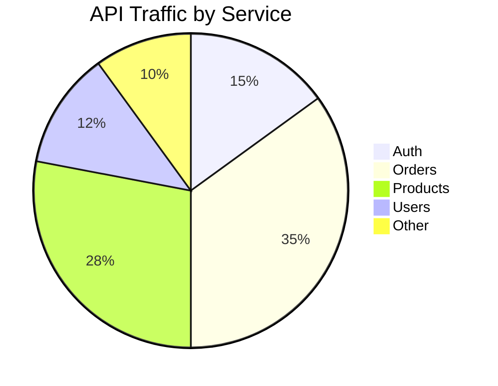

## Quadrant Chart

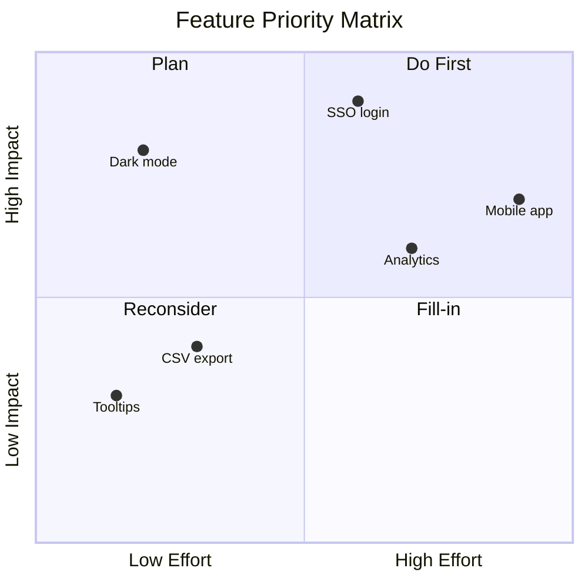
